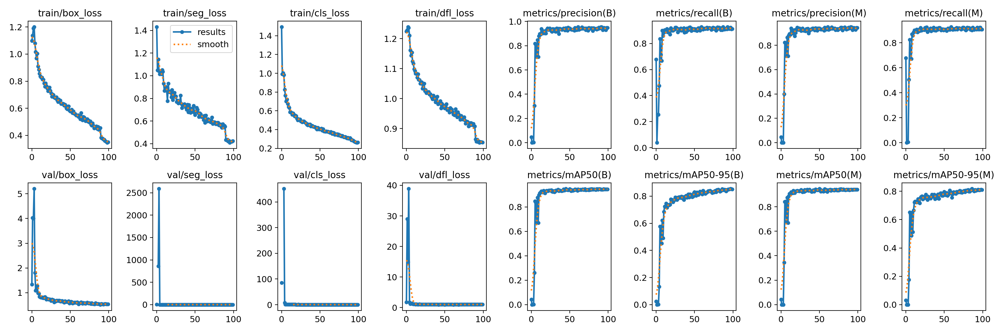
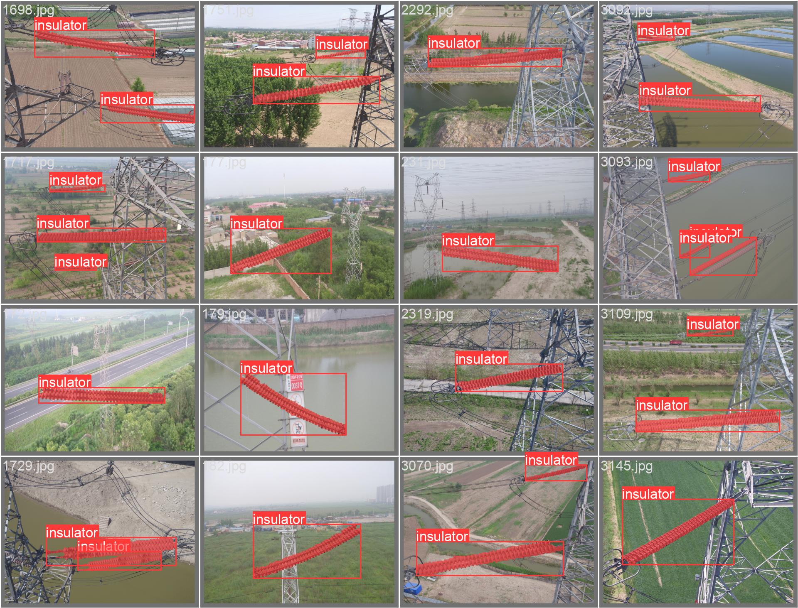
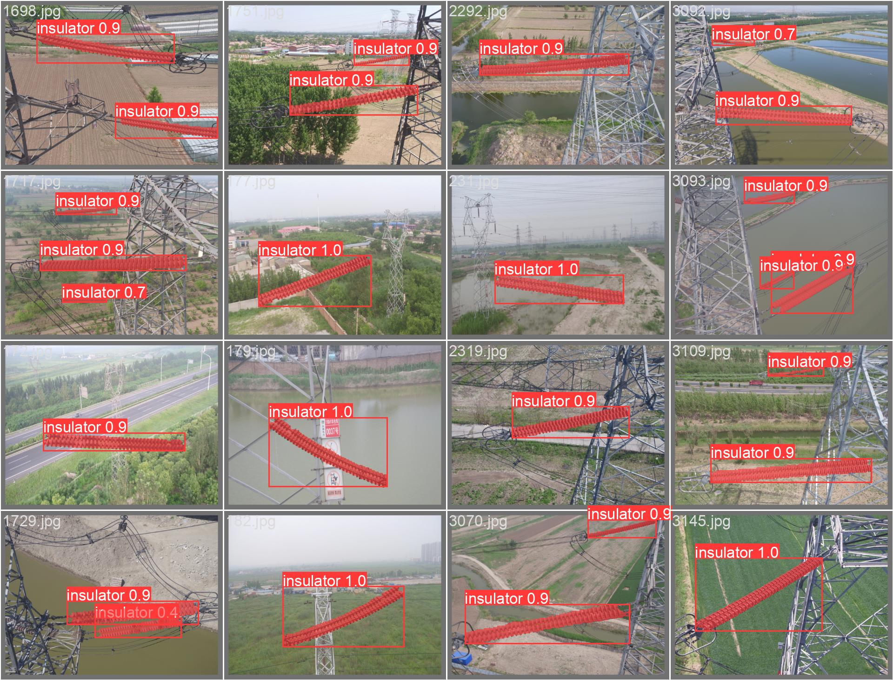

# Pin Insulator Instance Segmentation

## Train

- [CLIPD dataset](https://github.com/InsulatorData/InsulatorDataSet) is an image detection dataset for insulators.
- Preprocessed dataset into one insulator class and split into train/valid splits with a 80/20 ratio.
- Processed bounding box information according to YOLO format.
- Bounding boxes were input to mobile SAM model to autogenerate masks
- Autogenerated masks were used to train YOLOv8 segmentation model with [pretrained weights](https://github.com/ultralytics/assets/releases/download/v0.0.0/yolov8m-seg.pt) resulting in [Final trained weights](https://github.com/saeedzou/InsulatorDetSeg/blob/master/runs/best.pt).

## Test

- Uncomment and run the commented cell in [test notebook](https://github.com/saeedzou/InsulatorDetSeg/blob/master/Test.ipynb) (change the path to the image you want to test)

## Results

- precision(B): 0.9519
- recall(B): 0.9644
- mAP50(B): 0.9607
- mAP50-95(B): 0.8044
- precision(M): 0.9519
- recall(M): 0.9644
- mAP50(M): 0.9641
- mAP50-95(M): 0.8358

